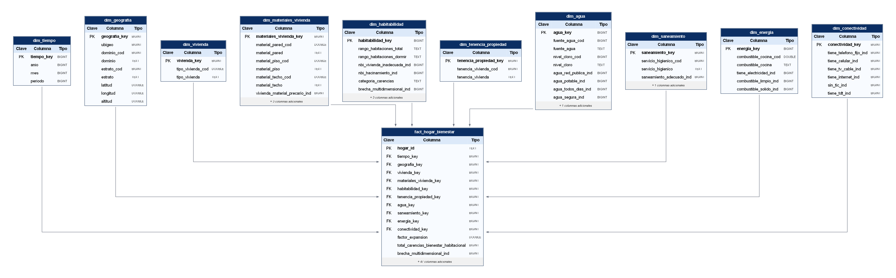

# ENAHO2025\_BI\_UP

Fuente principal:
ENAHO01-2025-100.csv

Tabla raw:
enaho\_raw\_hogar

Dimensiones:
dim\_tiempo
dim\_ubicacion
dim\_vivienda
dim\_material\_vivienda
dim\_servicios\_basicos
dim\_tecnologia
dim\_tenencia

Fact:
fact\_condiciones\_hogar

Grano:
1 hogar encuestado

# Marco Teórico del Datamart de Bienestar Habitacional, Servicios y Conectividad (ENAHO)

El análisis del bienestar habitacional exige integrar dimensiones de vulnerabilidad que no pueden capturarse mediante un único indicador. La pobreza monetaria, las necesidades básicas insatisfechas (NBI), la habitabilidad, el acceso a servicios, la conectividad digital y el gasto del hogar son fenómenos interdependientes que requieren una infraestructura de datos especialmente diseñada. Un datamart de propósito específico responde a este requerimiento al concentrar en un modelo dimensional la información necesaria para el análisis multidimensional del bienestar.

El sustento teórico descansa en el paradigma de la pobreza multidimensional. Alkire y Foster (2007, revisado en 2008) proponen un procedimiento de doble umbral (de privación individual y de agregación multidimensional) que permite medir la pobreza en varias dimensiones simultáneamente, superando las limitaciones de los enfoques monetarios unidimensionales. Feres y Mancero (2001) sistematizan el método de las NBI para América Latina, estableciendo dimensiones estructurales como vivienda inadecuada, hacinamiento, servicios insuficientes, inasistencia escolar y dependencia económica, que informan directamente las variables de la fuente de datos empleada.

## Fuente de datos: ENAHO, Módulo de Características de la Vivienda y del Hogar

La fuente primaria de este trabajo es el Módulo 100 (Características de la Vivienda y del Hogar) de la Encuesta Nacional de Hogares sobre Condiciones de Vida y Pobreza (ENAHO), producida por el Instituto Nacional de Estadística e Informática del Perú (INEI). Los microdatos corresponden al periodo 2025 y fueron obtenidos del repositorio oficial del INEI (2025a). La ENAHO tiene cobertura nacional, representatividad urbana y rural, y desagregación departamental, lo que la convierte en la fuente más adecuada para el análisis del bienestar habitacional en el contexto peruano (Clausen et al., 2025). La unidad de análisis es el hogar, y sus variables registran condiciones estructurales de la vivienda, acceso a servicios básicos, tenencia y equipamiento.

## El Modelo Dimensional como Fundamento Estructural

El modelo estrella es el paradigma de organización de datos adoptado para este datamart. Kimball y Ross (2013) argumentan que el modelo dimensional es una filosofía de diseño orientada a la comprensibilidad y la velocidad de consulta: las tablas de dimensiones describen el contexto de los hechos, mientras que la tabla de hechos registra las métricas numéricas de interés analítico. El *grain statement* (la declaración explícita de la granularidad) establece que cada fila representa un hogar en un año de encuesta. Moody y Kortink (2000) complementan este marco con una metodología para derivar modelos dimensionales a partir de estructuras relacionales preexistentes, relevante dado que la ENAHO tiene un esquema relacional ya establecido que debe traducirse sin pérdida de coherencia analítica.

Un concepto central es el de las *Slowly Changing Dimensions* (SCD), que describen cómo gestionar los cambios en los atributos de las dimensiones a lo largo del tiempo. Kimball y Ross (2013) proponen tres estrategias: sobreescritura (Type 1), historial completo (Type 2) o registro del valor previo (Type 3), cada una con implicaciones distintas sobre la comparabilidad de los indicadores entre rondas de encuesta.

## El Proceso ETL como Garantía de Calidad del Dato

La integración de los datos en el datamart se realiza mediante un flujo de Extracción, Transformación y Carga (ETL). Kimball y Ross (2013) subrayan que el ETL no es un traslado mecánico de datos, sino un proceso de aseguramiento de calidad que determina la confiabilidad de todos los análisis subsecuentes. La extracción transfiere los datos desde la fuente al entorno de procesamiento y puede ser completa (*full extraction*) para la carga histórica inicial, o incremental para actualizaciones periódicas.

El área de *staging* preserva los datos en su estado original antes de cualquier transformación, mientras que el *data profiling* permite evaluar su calidad mediante el análisis de distribuciones, valores nulos, outliers e integridad referencial entre módulos a través de las claves de unión de la ENAHO (`CONGLOME + VIVIENDA + HOGAR`) (Rahm & Do, 2000). Durante la transformación, las reglas de negocio traducen las definiciones conceptuales de los indicadores, como el índice de hacinamiento, las dimensiones NBI y el gasto per cápita, en fórmulas computables sobre las variables del Módulo 100 (Alkire & Foster, 2007, revisado en 2008; Feres & Mancero, 2001). La asignación de claves subrogadas desacopla el modelo de las claves naturales de la encuesta, protegiéndolo ante cambios entre rondas (Kimball & Ross, 2013). Finalmente, la carga sigue un orden dimensional estricto: las tablas de dimensión se pueblan antes que la tabla de hechos, y la validación post-carga reconcilia los conteos entre el *staging* y el datamart para garantizar que ningún registro fue perdido ni duplicado.

## Infraestructura de Almacenamiento: PostgreSQL y Neon

El almacenamiento del datamart se apoya en PostgreSQL. Para su despliegue en la nube se utiliza Neon, una plataforma serverless que separa el almacenamiento del cómputo, permitiéndole escalar dinámicamente según la carga de trabajo y reducir a cero el consumo de recursos en periodos de inactividad (Neon, 2024). Esta arquitectura elimina la necesidad de gestionar infraestructura manualmente y mantiene plena compatibilidad con el ecosistema estándar de PostgreSQL.

## Dimensiones Temáticas del Bienestar Habitacional

Las dimensiones temáticas del datamart corresponden a los dominios conceptuales del bienestar habitacional reconocidos en la literatura. La habitabilidad considera calidad estructural, seguridad de tenencia y espacio suficiente (Naciones Unidas, 2021), con el hacinamiento como indicador de vulnerabilidad asociado a riesgos sanitarios documentados (Lorentzen et al., 2022; World Health Organization, 2018; Villanueva-Paredes & Villanueva-Paredes, 2023). La conectividad digital se incorpora como dimensión de desigualdad estructural, dado que el acceso diferenciado a internet tiene efectos probados sobre la inclusión educativa y económica (Flores-Cueto et al., 2020; INEI, 2025b). El gasto del hogar añade la capa económica que permite evaluar la carga financiera de mantener condiciones adecuadas de vivienda y servicios (Deaton, 1997; Galarza et al., 2022). La integración de estas dimensiones en un modelo dimensional soportado por un flujo ETL auditado y una infraestructura serverless es lo que distingue a este datamart de una simple consolidación de tablas.

---

# Descripción de la Empresa y Problemática

El Instituto Nacional de Estadística e Informática (INEI) es el organismo técnico especializado encargado de producir y difundir información estadística oficial en el Perú. Entre sus principales investigaciones se encuentra la Encuesta Nacional de Hogares (ENAHO), estudio de alcance nacional que recopila información sobre las condiciones de vida de la población peruana en aspectos relacionados con vivienda, educación, salud, empleo, ingresos y acceso a servicios básicos.

Dentro de esta investigación, el módulo 100 denominado “Características de la Vivienda y del Hogar” reúne información vinculada a las condiciones habitacionales de los hogares peruanos, considerando variables como el tipo de vivienda, materiales de construcción, acceso a agua potable, saneamiento, electricidad, internet y gastos asociados a estos servicios. Esta información resulta fundamental para analizar la calidad de vida de la población y las desigualdades existentes entre distintos sectores del país.

En el Perú, durante el año 2025, continúan existiendo brechas significativas en las condiciones de vivienda, acceso a servicios básicos y conectividad de los hogares. Muchos hogares, especialmente en zonas rurales y sectores vulnerables, presentan limitaciones en el acceso continuo a servicios esenciales como agua potable, desagüe, electricidad e internet, así como condiciones habitacionales inadecuadas relacionadas con los materiales de construcción y disponibilidad de espacios adecuados para vivir.

Del mismo modo, existen diferencias importantes en el gasto que realizan los hogares para mantener estos servicios, evidenciando desigualdades económicas y limitaciones en la capacidad de acceso a condiciones de vida adecuadas. Estas brechas afectan directamente la calidad de vida de la población y dificultan el desarrollo equitativo entre las diferentes regiones y estratos socioeconómicos del país.

Frente a esta problemática, se propone el desarrollo de un datamart orientado al análisis de las condiciones de vivienda y acceso a servicios básicos de los hogares peruanos, utilizando información del módulo 100 de la ENAHO 2025. El objetivo es integrar, transformar y estructurar los datos mediante procesos ETL y modelado dimensional, facilitando la generación de indicadores y dashboards que permitan identificar patrones, comparar niveles de acceso y analizar las diferencias existentes entre hogares, regiones y grupos poblacionales.

---

| Columna    | PK/FK | Tipo de dato | Definición                                      | Nullable |
|------------|-------|--------------|------------------------------------------------|----------|
| tiempo_key | PK    | BIGINT       | Identificador único de combinación temporal.   | No       |
| anio       |       | TEXT         | Año de la encuesta.                            | No       |
| mes        |       | TEXT         | Mes de ejecución de la encuesta.               | No       |
| periodo    |       | TEXT         | Periodo de ejecución de la encuesta.           | No       |

---

## Referencias

Alkire, S., & Foster, J. (2007, revisado en 2008). *Counting and multidimensional poverty measurement* (OPHI Working Paper No. 7). Oxford Poverty and Human Development Initiative. https://ophi.org.uk/sites/default/files/ophi-wp7_vs2.pdf

Clausen, J., Barrantes, N., Trivelli, C., & Salas, F. (2025). Evaluating poverty in all its forms and dimensions: Monetary, multidimensional, and subjective poverty in Peru. *Social Indicators Research, 179*, 861–893. https://doi.org/10.1007/s11205-025-03641-7

Deaton, A. (1997). *The analysis of household surveys: A microeconometric approach to development policy*. Johns Hopkins University Press.

Feres, J. C., & Mancero, X. (2001). *El método de las necesidades básicas insatisfechas y sus aplicaciones en América Latina*. Comisión Económica para América Latina y el Caribe.

Flores-Cueto, J. J., Hernández, R. M., & Garay-Argandoña, R. (2020). Tecnologías de información: Acceso a internet y brecha digital en Perú. *Revista Venezolana de Gerencia, 25*(90), 504–527.

Galarza, F. B., Carbajal, M., & Aguirre, J. (2022). *Willingness to pay for improved water service: Evidence from urban Peru*. Peruvian Economic Association.

Instituto Nacional de Estadística e Informática. (2025a). *Encuesta Nacional de Hogares sobre Condiciones de Vida y Pobreza — ENAHO 2025: Módulo de características de la vivienda y del hogar* [Microdatos]. [https://proyectos.inei.gob.pe/microdatos/](https://proyectos.inei.gob.pe/microdatos/Detalle_Encuesta.asp?CU=19558&CodEncuesta=1031&CodModulo=01&NombreEncuesta=Condiciones+de+Vida+y+Pobreza+-+ENAHO&NombreModulo=Caracter%C3%ADsticas+de+la+Vivienda+y+del+Hogar)

Instituto Nacional de Estadística e Informática. (2025b). *Perú: Tecnologías de información y comunicación en los hogares, II trimestre 2025*. https://www.inei.gob.pe/biblioteca-virtual/boletines/tecnologias-de-la-informacion-y-comunicacion/

Kimball, R., & Ross, M. (2013). *The data warehouse toolkit: The definitive guide to dimensional modeling* (3.ª ed.). John Wiley & Sons.

Lorentzen, J. C., Johanson, G., Björk, F., & Stensson, S. (2022). Overcrowding and hazardous dwelling condition characteristics. *International Journal of Environmental Research and Public Health, 19*(23), 15542. https://doi.org/10.3390/ijerph192315542

Moody, D. L., & Kortink, M. A. R. (2000). From enterprise models to dimensional models: A methodology for data warehouse and data mart design. En M. Jeusfeld, H. Shu, M. Staudt & G. Vossen (Eds.), *Proceedings of the 2nd International Workshop on Design and Management of Data Warehouses (DMDW'2000)* (pp. 5-1–5-12). CEUR Workshop Proceedings. https://ceur-ws.org/Vol-28/paper5.pdf

Naciones Unidas. (2021). *Metadata for Sustainable Development Goal indicator 11.1.1*. United Nations Statistics Division. https://unstats.un.org/sdgs/metadata/?Text=&Goal=11&Target=11.1

Neon. (2024). *Neon documentation: Introduction to Neon serverless Postgres*. https://neon.com/docs/introduction

Rahm, E., & Do, H. H. (2000). Data cleaning: Problems and current approaches. *IEEE Data Engineering Bulletin, 23*(4), 3–13.
